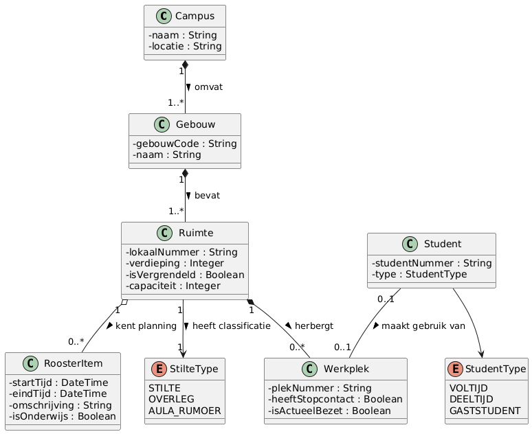

# Probleemdomein Canvas

Gebruik dit canvas om een breed beeld te krijgen van het vraagstuk en het probleemdomein. Vul in wat je al weet. Noteer bij onbekende punten welke informatie je nog moet ophalen.

## 1. Aanleiding en context

- [x] **Wat is de aanleiding voor het project?**
  Als je tussen twee colleges door even wilt doorwerken, begint de ellende al. Je loopt met een tas vol spullen door het gebouw en nergens is een fatsoenlijke plek te vinden. Uit de casus van Emma blijkt dat pijnlijk duidelijk: ze was 28 minuten lang aan het ronddwalen op zoek naar een rustige tafel waar ook nog eens een stopcontact zat. Van haar pauze van 50 minuten bleef uiteindelijk maar 14 minuten over om daadwerkelijk wat aan haar studie te doen. Meer dan de helft van haar vrije tijd ging gewoon op aan doelloos trappen lopen en lokalen checken.

- [x] **Wat gebeurt er momenteel?**
  Studenten lopen nu maar wat op de tast rond. Je pakt de trap naar de eerste verdieping van gebouw X, ziet dat alles vol zit, en steekt via de loopbrug over naar gebouw Y in de hoop dat daar wél plek is. Onderweg kom je langs stilteruimtes waar iedereen hutjemutje op elkaar gepakt zit, of tafels waar een enkele jas over een stoel hangt en een dichte laptop ligt om de plek 'bezet' te houden. En als je dan eindelijk een lege zaal ziet en de klink naar beneden duwt, zit de deur doodleuk op slot.

- [x] **Waarom is dit nu een probleem of kans?**
  Iedereen raakt hier gefrustreerd van en het vreet studietijd op. Het vreemde is: de campus is meestal niet eens écht te klein. Er staan regelmatig hele onderwijszalen leeg met het licht uit, alleen weet niemand of je daar naar binnen mag of dat er over tien minuten een klas aankomt. Hier ligt voor ons als softwareontwikkelaars een hele logische kans. Als we die beschikbaarheid en zaalroosters digitaal en realtime inzichtelijk maken, hoeft niemand meer blind rondjes te lopen.

- [x] **In welke omgeving of context speelt het vraagstuk?**
  Het speelt zich af op de campus van Windesheim in Zwolle, met name in en tussen de drukkere onderwijsgebouwen zoals X en Y, de centrale bibliotheek en de open studieruimtes rondom de aula.

- [x] **Zijn er gebeurtenissen of ontwikkelingen waardoor het vraagstuk urgent is?**
  Tijdens de piekuren rond het middaguur en in de weken voor de tentamens loopt het helemaal spaak. Dan wil opeens iedereen tegelijk een rustig hoekje om te blokken. Je ziet studenten dan letterlijk op de grond tegen de muur aan zitten werken omdat alle reguliere plekken vergeven zijn.

## 2. Het probleem

- [x] **Wat is het probleem dat opgelost moet worden?**
  Je kunt nu nergens centraal zien welke werkplek op de campus vrij is, wat voor voorzieningen er zijn en of de zaal überhaupt open is. Alle informatie hangt af van toeval of papieren briefjes op deuren. Pas als je voor een gesloten deur staat of ziet dat alle stopcontacten al bezet zijn, weet je dat je weer verder kunt lopen.

- [x] **Voor wie is dit een probleem?**
  Voltijdstudenten merken het direct als ze tussenuur hebben en snel code willen kloppen of een verslag moeten afmaken.
  Deeltijdstudenten lopen er 's avonds tegenaan, omdat ze vaak geen idee hebben welke vleugels openblijven en waar ze na werktijd nog naar binnen kunnen.
  Gaststudenten of studenten van een andere faculteit snappen de informele gewoontes nog niet en weten de rustige hoekjes niet te vinden.
  En de baliemedewerkers en conciërges worden er ook niet vrolijk van, want die krijgen de hele dag studenten aan hun bureau met de vraag waar ze in vredesnaam kunnen zitten.

- [x] **Wanneer treedt het probleem op?**
  Vrijwel elke werkdag tussen 11:00 en 14:00 wanneer colleges wisselen en iedereen pauze heeft. In tentamenperiodes is het de hele dag raak. 's Avonds ontstaat er weer een ander probleem: dan gaan vleugels op slot en weet niemand welke ruimtes nog toegankelijk zijn.

- [x] **Waar treedt het probleem op?**
  In de gangen en trappenhuizen van Windesheim, vooral op de route tussen gebouw X en gebouw Y, en rondom de centrale studieplekken bij de bieb.

- [x] **Hoe vaak komt het probleem voor?**
  Dagelijks op piekmomenten. Vrijwel elke student die tussen twee lessen een werkplek zoekt, heeft ermee te maken.

- [x] **Wat zijn de gevolgen van het probleem?**
  Mensen verliezen kostbare tijd. Als je accu bijna leeg is en je moet 25 minuten lopen om een stopcontact te vinden, kun je amper nog wat doen. Studenten wijken uit pure wanhoop uit naar de kantine, maar daar word je gek van het kabaal en kun je je niet concentreren. Het zorgt voor een hoop ergernis en onnodige drukte op de gangen.

- [x] **Hoe groot is de impact?**
  Als je kijkt naar Emma: 28 minuten zoeken op een pauze van 50 minuten betekent dat meer dan de helft van haar tussenuur in rook opging. Dat tikt over een heel semester flink aan op je studieresultaten. Voor de hogeschool betekent het dat dure vierkante meters leegstaan terwijl studenten klagen over ruimtegebrek.

- [x] **Wat gebeurt er als we niets doen?**
  Dan blijft het dwalen doorgaan. Mensen gaan nog asocialer plekken bezet houden met tassen en jassen, de irritaties lopen op en lokalen met een roostergat blijven nutteloos leegstaan achter gesloten deuren.

## 3. Doel en gewenste situatie

- [x] **Wat wil de opdrachtgever bereiken?**
  Windesheim wil dat studenten snel en zonder stress een goede werkplek vinden, en dat de beschikbare lokalen en studiehoeken veel gelijkmatiger gebruikt worden.

- [x] **Wat moet voor gebruikers verbeteren?**
  Geen doelloze kilometers meer maken door het gebouw. Je pakt je telefoon, ziet direct waar plek is, weet of er stroom aanwezig is en of het er stil is. En minstens zo belangrijk: je moet erop kunnen vertrouwen dat de deur van dat lokaal ook echt open is.

- [x] **Wanneer is het project succesvol?**
  Als een student binnen één à twee minuten op zijn scherm een geschikte plek spot en daar vervolgens zonder gedoe kan gaan zitten werken.

- [x] **Welke concrete verandering moet zichtbaar zijn?**
  Minder groepjes studenten die zoekend door de gangen van gebouw X en Y zwerven. Lokalen waar even geen les is worden benut door studenten met laptops. En geen overvolle kantines meer vol mensen die eigenlijk een rustige studieplek zochten.

- [x] **Zijn er meetbare doelen of succescriteria?**
  De zoektijd moet omlaag van bijna een half uur naar minder dan 5 minuten.
  Minimaal 90% van de plekken die als vrij op de app staan, moet bij aankomst ook daadwerkelijk leeg en open zijn.
  De applicatie moet vlot reageren: binnen 2 seconden moet het overzicht geladen zijn op je smartphone via het campusnetwerk.
  Lokalen die tussen lessen minstens een uur leegstaan moeten vindbaar zijn voor zelfstudie.

## 4. Gebruikers en andere betrokkenen

- [x] **Wie gebruiken de huidige of toekomstige oplossing?**
  Studenten vormen de grootste groep gebruikers, die kijken op hun mobiel of laptop waar ze kunnen zitten. Daarnaast kunnen baliemedewerkers of conciërges het systeem raadplegen om zoekende studenten de goede kant op te sturen of zaalstatussen aan te passen.

- [x] **Wie ervaren het probleem?**
  Studenten zoals Emma lopen er elke dag tegenaan. Maar ook receptiemedewerkers die constant dezelfde vragen moeten beantwoorden, en docenten die tijdens hun les afgeleid worden door studenten die door de ruitjes naar binnen gluren om te zien of het lokaal leeg is.

- [x] **Wie heeft belang bij de oplossing?**
  Studenten willen gewoon rustig kunnen zitten met stroom voor hun laptop. Facilitair Beheer wil af van klachten over volle zalen en wil betere cijfers zien over lokaalbezetting. De opleidingen willen dat studenten hun tussenuur nuttig besteden aan projectwerk in plaats van ronddolen.

- [x] **Wie heeft invloed op beslissingen?**
  De opdrachtgever bij Facilitair Beheer, de afdeling IT (die bepaalt of we ergens een API-koppeling mee mogen maken), en de roosteraars die bepalen hoe streng er met zalen wordt omgegaan.

- [x] **Wie beschikt over belangrijke kennis?**
  Roosteraars weten precies hoe zaalschema's en reserveringen in software zoals Xedule werken. Conciërges weten welke deuren om welke reden op slot gaan en hoe het zit met beveiliging en schoonmaak. En studenten zelf weten precies welke plekken fijn zijn en waar het wifi-signaal of de stroomvoorziening bagger is.

- [x] **Wie moet de oplossing accepteren of goedkeuren?**
  Onze docenten en examinatoren van de opleiding voor de projectbeoordeling, de projecteigenaar bij Facilitair, en iemand van security of privacy die moet aftekenen dat we netjes met studentgegevens omgaan.

## 5. Huidige werkwijze

- [x] **Hoe wordt het werk nu uitgevoerd?**
  Helemaal handmatig en op goed gesternte. Je loopt een willekeurige gang in en hoopt dat je geluk hebt.

- [x] **Welke stappen worden doorlopen?**
  Je college is afgelopen en je loopt met je laptop onder je arm lokaal X1.12 uit.
  Je checkt de open plekken op de verdieping; alles bezet of volgelegd met spullen.
  Je appt snel in een groep met klasgenoten of iemand toevallig ergens een vrije tafel weet.
  Niemand reageert direct, dus je loopt via de luchtbrug naar gebouw Y.
  Op de tweede verdieping zie je een lege ruimte, je loopt ernaartoe en probeert de deurkruk. Op slot.
  Na 25 minuten rondjes lopen ben je er klaar mee en plof je maar neer op een kruk in de kantine, terwijl je batterijicoontje inmiddels rood kleurt.

- [x] **Welke mensen, systemen en hulpmiddelen zijn daarbij betrokken?**
  Studenten, conciërges en docenten met een sleutelpas. Qua hulpmiddelen is er niks officieels: studenten sturen elkaar berichtjes in WhatsApp ("is er ergens plek in X?"), docenten plakken af en toe een A4'tje op een deur en conciërges lopen met fysieke sleutelbossen rond.

- [x] **Waar ontstaan problemen, vertragingen of fouten?**
  Er is nergens actuele statusinformatie te vinden. Studenten lopen voor jan met de korte achternaam naar zalen die op slot zitten. Of mensen denken dat een tafel bezet is omdat er al twee uur een sjaal over een stoel hangt terwijl de eigenaar nergens te bekennen is.

- [x] **Welke workarounds gebruiken mensen nu?**
  Klassieke handdoekje-leggen praktijken: 's ochtends vroeg meteen een jas of een kladblok op een tafel dumpen zodat niemand anders erop gaat zitten. Daarnaast informele groepsapps waarin foto's van lege lokalen worden rondgestuurd. En sommigen lopen naar de receptie om te smeken of een zaal open mag.

- [x] **Wat werkt in de huidige situatie juist goed?**
  Het feit dat studenten elkaar via WhatsApp proberen te helpen laat zien dat de wil om informatie te delen er al is. Alleen is een chatgroep met zestig man volkomen onoverzichtelijk en veroudert die info binnen vijf minuten.

## 6. Informatie en gegevens

- [x] **Welke informatie is nodig binnen het proces?**
  Waar de plekken zijn: gebouw, verdieping, kamernummer.
  Wat er aanwezig is: stopcontacten, externe beeldschermen, en of het een stiltezone, overlegplek of open ruimte is.
  De status: vrij, bezet, gereserveerd voor les, of afgesloten.
  Tot wanneer de ruimte beschikbaar is volgens het rooster, zodat je weet of je er een half uur of drie uur kunt zitten.
  Toegankelijkheid: openingstijden en eventuele voorwaarden voor wie er naar binnen mag.

- [x] **Welke gegevens worden ingevoerd?**
  Beheerders voeren basisgegevens in over zalen en voorzieningen.
  Het roostersysteem levert de collegetijden per lokaal aan.
  Gebruikers kunnen eventueel zelf een melding doen via de app, bijvoorbeeld door een QR-code op een tafel te scannen om in te checken of door aan te geven dat een lokaal onverwacht op slot zit.

- [x] **Welke gegevens worden opgeslagen?**
  Datamodellen voor gebouwen, ruimtes, specifieke werkplekken en voorzieningen.
  Roosterblokken per ruimte met begin- en eindtijden.
  Statusupdates en timestamps van bezetting.
  Geanonimiseerde gebruiksdata om later patronen en piekmomenten te kunnen analyseren.

- [x] **Waar komen deze gegevens vandaan?**
  De zaalroosters van Windesheim (via een koppeling of export uit bijvoorbeeld Xedule).
  Lijsten en plattegronden van Facilitair Beheer.
  Live input van studenten die op een plek zitten of een statuswijziging doorgeven.

- [x] **Wie mag welke gegevens bekijken of wijzigen?**
  Studenten kunnen alle zalen, statussen en filters bekijken en mogen zelf een statusmelding of check-in doorgeven.
  Beheerders en facilitair personeel kunnen zalen toevoegen, gegevens aanpassen en handmatig een zaal blokkeren of vrijgeven.

- [x] **Zijn er privacy- of beveiligingsaspecten?**
  We slaan bewust geen persoonsgegevens op bij bezette werkplekken. We houden alleen bij óf een stoel bezet is, niet door wie of welk studentnummer erbij hoort. Geen tracking van individuele studenten dus, puur privacy by design om gezeur met de AVG te voorkomen. Voor het doorgeven van meldingen moeten we rate limiting inbouwen zodat niemand met een scriptje alle zalen op 'bezet' kan zetten.

## 7. Regels en beperkingen

- [x] **Welke bedrijfsregels gelden?**
  Geplande lessen en tentamens gaan altijd voor op studenten die zelfstandig willen werken.
  Als er binnen twintig minuten een college begint in een zaal, mag het systeem die zaal niet meer aanraden als vrije werkplek.
  Een zaal die op slot zit mag nooit als beschikbaar worden getoond.

- [x] **Zijn er wettelijke of organisatorische regels?**
  Privacywetgeving (AVG): anonieme gegevensverwerking staat voorop.
  Brandveiligheidsvoorschriften: je mag een ruimte niet voller proppen dan het maximaal toegestane aantal personen.

- [x] **Welke uitzonderingssituaties bestaan er?**
  Een docent die op het laatste moment besluit zijn les te verplaatsen of eerder stopt, waardoor het rooster niet meer klopt met de werkelijkheid.
  Vleugels van gebouwen die om 17:00 of 18:00 dichtgaan voor schoonmaak of beveiliging.
  Tentamendagen waarop hele vleugels worden afgesloten voor publiek.

- [x] **Zijn er technische beperkingen?**
  We hebben geen toegang tot dure IoT-sensoren of drukkussens op stoelen. We kunnen niet zomaar hardware op Windesheim installeren. Alles moet dus softwarematig opgelost worden met bestaande data, roosterkoppelingen en input van gebruikers zelf.
  Op sommige plekken in de uithoeken van gebouw Y is het wifi-signaal matig, dus de app moet ook blijven werken bij een haperende verbinding.

- [x] **Zijn er eisen vanuit bestaande systemen?**
  We moeten data kunnen peuteren uit de roostersoftware van Windesheim. Als er een REST-API is met JSON-output is dat geweldig, maar we moeten er rekening mee houden dat we misschien moeten werken met een iCal-feed of een handmatige CSV-export.

- [x] **Zijn tijd, budget of capaciteit beperkt?**
  Ons budget is nul euro. We moeten het doen met open source tools, gratis hostingtiers en onze eigen ontwikkeluren binnen dit semesterblok.

## 8. Bestaande oplossingen

- [x] **Is er al een systeem of oplossing?**
  Geen centraal systeem dat laat zien waar je nu kunt studeren. Je hebt de officiële rooster-app van Windesheim, maar die vertelt je alleen wanneer een lokaal les heeft, niet of je er tussen de lessen door mag zitten en al helemaal niet of er stopcontacten zijn. Verder hangen er soms uitgeprinte roosters op de deuren.

- [x] **Wat werkt daar goed aan?**
  Een briefje op de deur kost niks en als je ervoor staat zie je direct of er die middag nog les is. WhatsApp-groepen werken lekker snel omdat iedereen de app al op zijn telefoon heeft.

- [x] **Wat werkt niet goed?**
  Die briefjes zijn vaak al verouderd voordat de inkt droog is, en je moet alsnog naar het lokaal lopen om het te lezen. WhatsApp-groepen verzuipen in ruis en je kunt er niet fatsoenlijk in filteren op eigenschappen zoals een stiltezone. De rooster-app houdt geen rekening met flexibel gebruik door studenten.

- [x] **Welke andere systemen moeten mogelijk samenwerken met de oplossing?**
  Het centrale zaalrooster van de school en eventueel het inlogsysteem van Windesheim (SURFconext of Azure AD) als we bepaalde beheerrollen willen beveiligen.

- [x] **Zijn er vergelijkbare oplossingen beschikbaar?**
  Universiteiten zoals de TU Delft of Erasmus hebben soms eigen reserveringsportalen voor bibliotheekplekken. In het bedrijfsleven heb je pakketten zoals Mapiq. Maar die kosten bakken met geld, draaien vaak op dure sensoren en zijn veel te log voor een student die gewoon een tussenuur wil overbruggen.

## 9. Begrippen en taal

- [x] **Welke belangrijke begrippen worden binnen het domein gebruikt?**
  Werkplek: een specifieke stoel met tafelruimte waar je je laptop kwijt kunt.
  Ruimte: een lokaal of afgebakende zone (zoals X2.04 of de stilteruimte op verdieping 1).
  Faciliteiten: zaken zoals stroompunten, externe schermen en kabelaansluitingen.
  Stiltegraad: het geluidsniveau dat bedoeld is voor de ruimte (stilte, zacht overleg, of vrije inloop zoals de kantine).
  Spookbezetting: stoelen waar niemand zit, maar die geclaimd zijn met een tas, jas of oplader.
  Roostergat: het tijdsvenster tussen twee ingeroosterde colleges in hetzelfde lokaal.

- [x] **Betekenen deze begrippen voor iedereen hetzelfde?**
  Totaal niet. Een student verstaat onder een werkplek een tafel met stopcontact waar je direct kunt werken. Een roosteraar ziet een werkplek puur als een capaciteitsgetal in een spreadsheet. En facilitair personeel noemt een lokaal pas 'beschikbaar' als het open is en er geen schoonmaakbeurt gepland staat.

- [x] **Zijn er vaktermen of afkortingen die uitgelegd moeten worden?**
  Roosterblok: de vaste collegeduur (meestal blokken van 45 of 50 minuten).
  Crowdsourcing: informatie ophalen door gebruikers zelf data te laten aanleveren in plaats van met automatische meetapparatuur te werken.
  SSO: Single Sign-On, oftewel inloggen met je Windesheim-account.

- [x] **Welke objecten of concepten spelen een belangrijke rol?**
  De kernobjecten en hun onderlinge relaties zijn uitgewerkt in het domeinmodel:

  

  *(Zie ook het bestand: [docs/ontwerp/Domeinmodel.png](docs/ontwerp/Domeinmodel.png))*

  Kort samengevat onderscheiden we:
  * `Campus` en `Gebouw`: de fysieke locaties (zoals Campus Windesheim, Gebouw X en Y).
  * `Ruimte`: het lokaal of de zone met attributen zoals `lokaalNummer`, `verdieping`, `capaciteit` en `isVergrendeld`.
  * `StilteType`: de akoestische classificatie per ruimte (`STILTE`, `OVERLEG`, `AULA_RUMOER`).
  * `RoosterItem`: de zaalplanning met `startTijd`, `eindTijd`, `omschrijving` en `isOnderwijs` (bepaalt of een zaal vrij is).
  * `Werkplek`: de fysieke stoel/plek met `plekNummer`, `heeftStopcontact` en de status `isActueelBezet`.
  * `Student` & `StudentType`: de student die gebruikmaakt van een werkplek, gecategoriseerd als `VOLTIJD`, `DEELTIJD` of `GASTSTUDENT`.

## 10. Aannames en onzekerheden

- [x] **Wat denken we te weten, maar hebben we nog niet gecontroleerd?**
  We nemen aan dat studenten bereid zijn even op een knop te drukken of een QR-code te scannen om een status door te geven. Als niemand dat doet, klopt onze data na een paar uur niet meer.
  We nemen aan dat lege lokalen tussen colleges zomaar gebruikt mogen worden, maar docenten draaien ze vaak reflexmatig op slot.
  We hopen dat we toegang kunnen krijgen tot de roosterdata van Windesheim via een nette koppeling, maar misschien schermt IT dat potdicht af.

- [x] **Welke informatie ontbreekt nog?**
  Kunnen we bij de zaalrooster-data via een API, of moeten we het met statische testdata doen?
  Wat zijn de officiële regels van Facilitair over het ontgrendelen van lege lokalen?
  Mogen deeltijd- en gaststudenten in elk gebouwdeel zitten of zijn bepaalde zalen gereserveerd voor specifieke academies?

- [x] **Waar spreken bronnen of betrokkenen elkaar tegen?**
  Emma wil gewoon snel zien wat er nú vrij is. Andere studenten roepen dat ze van tevoren willen reserveren om zekerheid te hebben. Facilitair Beheer wil absoluut geen reserveringen, omdat mensen dan reserveren en niet komen opdagen (no-shows). Conciërges willen lokalen juist dichtdraaien om diefstal en rommel te voorkomen.

- [x] **Welke aannames kunnen grote gevolgen hebben voor de oplossing?**
  Als we puur op software focussen en denken dat de data vanzelf klopt. Als onze app zegt dat lokaal X1.40 vrij is, en een student loopt daarnaartoe en treft een vergrendelde deur of een zaal vol jassen aan, gebruikt die student de app nooit meer.

- [x] **Welke vragen moeten we als eerste beantwoorden?**
  Of we bij de roosterdata kunnen en hoe het beleid rondom gesloten deuren in elkaar steekt. Zie de tabel in sectie 12.

## 11. Eerste requirements

Noteer alleen requirements waarvoor voldoende informatie beschikbaar is.

- [x] **Welke functionaliteit lijkt noodzakelijk?**
  FR1: De gebruiker kan per gebouw en verdieping een live overzicht opvragen van beschikbare ruimtes en werkplekken.
  FR2: De gebruiker kan filteren op stilteniveau en de aanwezigheid van stopcontacten.
  FR3: Het systeem toont per lokaal tot hoe laat het beschikbaar is voordat het volgende college begint.
  FR4: Gebruikers kunnen met één klik een statuswijziging melden (bijvoorbeeld 'plek bezet' of 'deur zit op slot').

- [x] **Welke kwaliteitseisen lijken belangrijk?**
  NFR1 - Performance: De mobiele web-app moet binnen 2 seconden de actuele ruimtelijst laden, ook op een matige campus-wifi verbinding.
  NFR2 - Usability: De interface moet ontworpen zijn voor smartphones en met één hand te bedienen zijn terwijl je door een gang loopt.
  NFR3 - Betrouwbaarheid: De getoonde status mag maximaal een paar minuten achterlopen op de werkelijkheid.
  NFR4 - Privacy: We slaan geen studentnummers of individuele apparaatgegevens op bij bezette plekken.

- [x] **Welke beperkingen lijken als requirement te gelden?**
  Geen fysieke sensoren of hardware installeren op de campus.
  Geen verplichte app-installatie via de App Store; het moet direct werken in de mobiele browser (Safari/Chrome).

- [x] **Kunnen deze requirements worden herleid naar een probleem, behoefte of doel?**
  Zeker weten. FR1 en FR2 lossen direct Emma's probleem op: ze wil binnen no-time een rustige plek met stroom vinden. FR3 voorkomt dat iemand net lekker zit en er na vijf minuten een docent met een klas binnenkomt. NFR2 sluit direct aan op de situatie: je zoekt een plek terwijl je loopt met een tas om je schouder.

- [x] **Kunnen we bepalen hoe we later controleren of eraan voldaan is?**
  Met geautomatiseerde unittests voor de filter- en roosterlogica.
  Met Lighthouse audits om de laadsnelheid en mobiele weergave te controleren.
  Door zelf op de campus een testronde te doen met medestudenten en te timen hoe snel ze met onze web-app een vrije werkplek vinden vergeleken met de oude situatie.

## 12. Vervolgonderzoek

Wat moeten we nog uitzoeken?

| Vraag / onzekerheid | Waarom moeten we dit weten? | Wie of wat kan antwoord geven? | Hoe gaan we dit onderzoeken? |
|---|---|---|---|
| Is er een API of data-export beschikbaar van het Windesheim roostersysteem? | Bepaalt onze software-architectuur: kunnen we live koppelen of moeten we werken met handmatige imports of mock data? | ICT-servicedesk / Functioneel Applicatiebeheer | Technische documentatie opvragen en contact opnemen met IT-beheer. |
| Mogen lege onderwijslokalen tijdens roostergaten officieel opengesteld blijven voor zelfstudie? | Bepaalt tot wel 40% van de effectieve werkplekcapaciteit op de campus; voorkomt dat studenten voor dichte deuren staan. | Facilitair Beheer en Conciërges van gebouw X en Y | Kort interview afnemen met de facilitair teamleider. |
| Hoe houden we de bezettingsdata betrouwbaar zonder dure IoT-sensoren? | Voorkomt dat de app vervuilt met 'spookbeschikbaarheid' en studenten het vertrouwen in het systeem verliezen. | Medestudenten (eindgebruikers) en docent-begeleider | Prototype testen met een QR-code check-in flow en usability-tests uitvoeren op de gang. |

## Eindcheck

Na deze verkenning moet je minimaal antwoord kunnen geven op:

- [x] **Wat is het probleem?**
  Studenten verspillen kostbare studietijd aan het doelloos zoeken naar werkplekken door een compleet gebrek aan realtime, centraal inzicht in vrije plekken, faciliteiten (zoals stopcontacten) en zaalstatussen.
- [x] **Voor wie is het een probleem?**
  Voor voltijd-, deeltijd- en gaststudenten die tussen lessen willen studeren, en voor de facilitaire dienst en baliemedewerkers die grip en overzicht op de campuscapaciteit missen.
- [x] **Waarom is het een probleem?**
  Het verlaagt de effectieve studietijd drastisch (meer dan de helft van een tussenuur gaat op aan zoeken), veroorzaakt frustratie en rumoer, en zorgt dat ruimtes scheef benut worden terwijl zalen leeg achter slot staan.
- [x] **Hoe werkt de huidige situatie?**
  Studenten dwalen fysiek door gangen en gebouwen, gluren door ramen, gebruiken informele WhatsApp-groepjes en houden plekken oneerlijk bezet met jassen en tassen ("handdoekje leggen").
- [x] **Wat willen we bereiken?**
  Een snelle (< 5 minuten), betrouwbare en mobiele softwareoplossing die studenten direct matcht met een geschikte, vrije werkplek op basis van hun wensen (stroom, stilte) en actuele zaalbeschikbaarheid.
- [x] **Wat weten we nog niet?**
  Of we toegang krijgen tot de rooster-API van Windesheim, of lege lokalen tussen lessen open mogen blijven van Facilitair, en hoe we check-ins het beste laagdrempelig kunnen houden zonder sensoren.
- [x] **Wie moeten we daarvoor spreken of onderzoeken?**
  IT-beheer van Windesheim (voor de API), de teamleider van Facilitair Beheer (voor het deur- en zaalbeleid), en medestudenten via een prototype-test van de check-in flow.